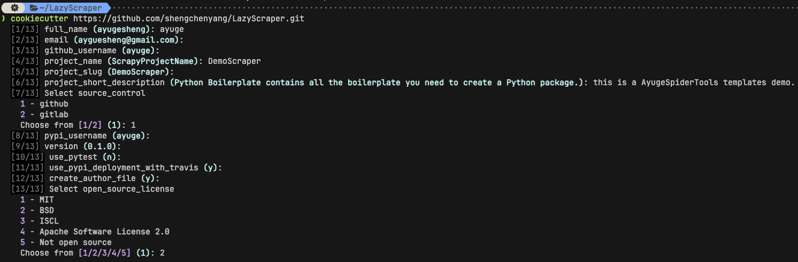
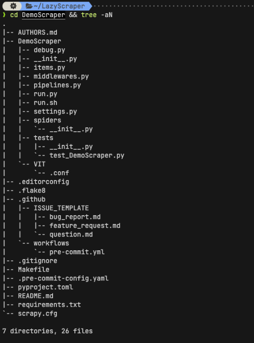

# LazyScraper 项目说明

## 简介

> 用于 python AyugeSpiderTools 项目结构模版生成。

- 在创建 `scrapy` 项目时，每次都需要配置开发工具，测试工具，`CI/CD` 等内容，非常需要一种方式来快速创建项目模版；
- `AyugeSpiderTools` 创建的项目结构与 `scrapy` 保持一致，其他配置和运行等模版则可通过此项目实现；
- 基于 `cookiecutter` 可以很方便地实现个性化项目模版的创建。

## 使用方式

```shell
# 需要提前安装好 `cookiecutter`
pip install cookiecutter

# 然后根据 repo 模版生成项目
cookiecutter https://github.com/shengchenyang/LazyScraper.git
```

## 运行示例

> 使用方式示例：



> 结果示例：



## 注意事项

- 项目模板创建的 `run.sh` 默认从项目根目录的虚拟环境文件夹中激活环境，用户可在创建项目时通过自定义 `virtualenv_type` 来选择不同风格，默认为 `.venv`。

# 补充

- 可以根据 `github` 上的各种 `cookiecutter` 模版方便地创建项目，也可以 `fork` 他人优秀的项目结构来自定义项目。
- 更多介绍及示例请在 `cookiecutter` 文档中查看。
